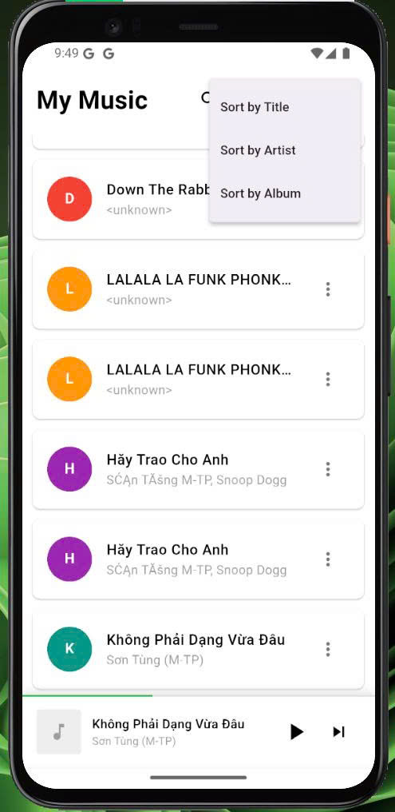
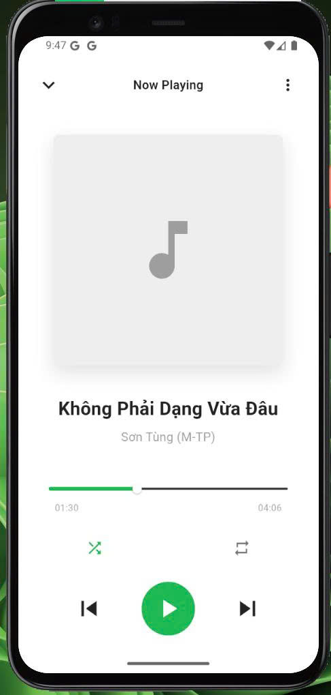
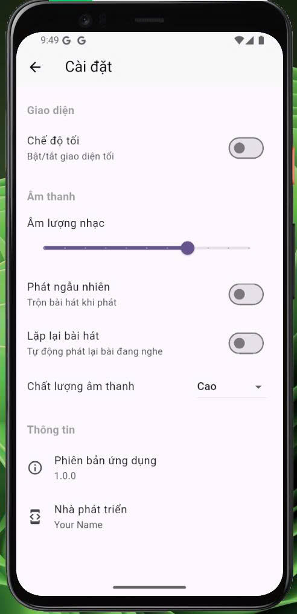
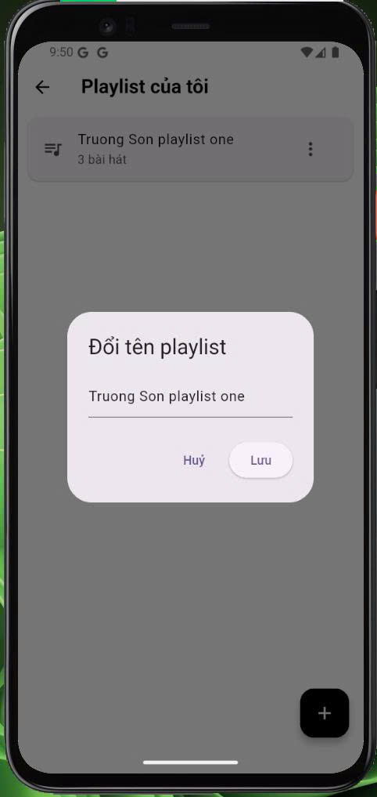
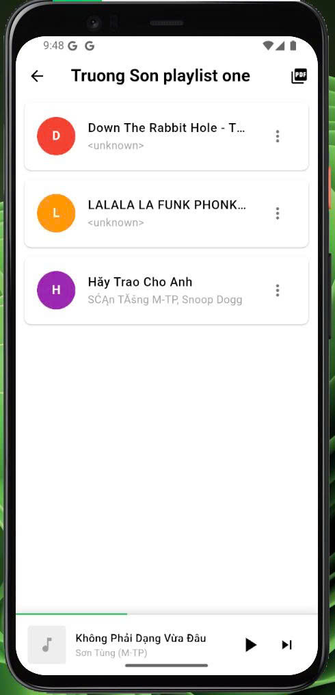
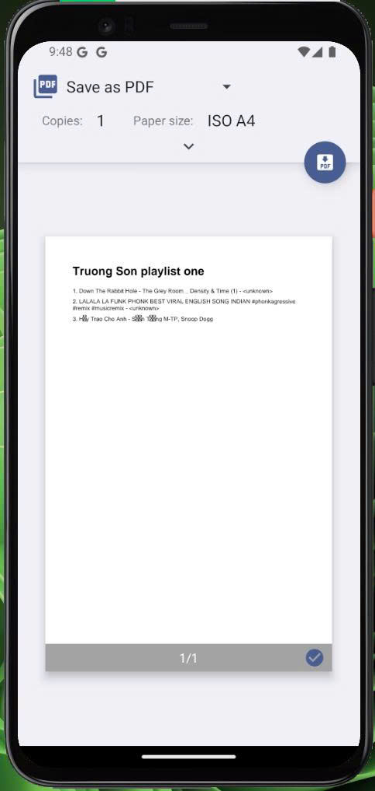

# 📝 Office Music App – Flutter  
Ứng dụng nghe nhạc hiện đại, nhẹ nhàng và hoạt động hoàn toàn offline, phù hợp cho môi trường văn phòng.

**Office Music App** được phát triển bằng **Flutter**, sử dụng **Provider** để quản lý trạng thái, kết hợp **SQLite / local storage** để lưu trữ playlist và thông tin người dùng. Ứng dụng được thiết kế với giao diện **tối giản – nhanh – trực quan**, cho phép người dùng dễ dàng quản lý playlist, nghe nhạc và điều khiển phát lại.

Ứng dụng ưu tiên trải nghiệm người dùng với giao diện sạch sẽ, danh sách playlist trực quan, mini player luôn hiển thị và hỗ trợ các tính năng như phát ngẫu nhiên, lặp lại, xuất PDF playlist. Tất cả dữ liệu được lưu cục bộ, đảm bảo quyền riêng tư và không phụ thuộc Internet.

Dù nhỏ gọn, ứng dụng vẫn cung cấp đầy đủ các chức năng cần thiết cho môi trường văn phòng, đồng thời có khả năng mở rộng trong tương lai như đồng bộ đám mây, tìm kiếm nâng cao và cài đặt cá nhân hóa.

## 🎥 Demo Video
[👉 Xem video demo](https://drive.google.com/drive/folders/12l9tscMdZ8PR1n_ugHJ5Py88XW3eR5LD?hl=vi)

## 🚀 Công Nghệ Sử Dụng

### 📱 Framework & Platform
- **Flutter 3.x** – Framework đa nền tảng để xây dựng UI và logic ứng dụng  
- **Dart** – Ngôn ngữ lập trình chính  
- **Material Design** – Bộ UI mặc định cho giao diện hiện đại  

### 🗄️ Local Storage
- **Shared Preferences / SQLite** – Lưu trữ playlist và thông tin nhạc offline  
- **Path Provider** – Lấy đường dẫn thư mục lưu trữ dữ liệu  
- **Provider** – Quản lý trạng thái ứng dụng  

### 🎨 UI/UX & Utilities
- **Custom Widgets** – Mini Player, Song Tile, Playlist Card  
- **Color & Theme Utilities** – Hệ thống màu và giao diện chung  
- **Responsive Layout** – Tối ưu hiển thị trên nhiều thiết bị  

## ✨ Tính Năng Chính

### 🎵 Quản Lý Nhạc & Playlist
- Tạo playlist mới  
- Thêm/xóa bài hát khỏi playlist  
- Xem danh sách bài hát chi tiết trong playlist  
- Xuất PDF playlist  
- Giao diện danh sách bài hát & playlist trực quan  

### 🔊 Điều Khiển Phát Nhạc
- Mini player luôn hiển thị  
- Phát/paus, next/previous track  
- Phát ngẫu nhiên (Shuffle)  
- Lặp lại bài hát hoặc playlist (Repeat)  
- Điều chỉnh âm lượng  

### 🔎 Tìm Kiếm & Lọc
- Tìm kiếm bài hát theo tiêu đề, nghệ sĩ, album  
- Lọc nhanh playlist  
- Cập nhật kết quả theo thời gian thực  

### ⚡ Trải Nghiệm Người Dùng
- Giao diện hiện đại, tối giản, dễ thao tác  
- Animation nhẹ nhàng và trực quan  
- Tối ưu tốc độ load và trải nghiệm mượt mà  

## 📸 Ảnh Minh Hoạ
<table>
<tr>
  <td></td>
  <td></td>
  <td></td>
  <td></td>
</tr>
<tr>
  <td></td>
  <td></td>
  <td></td>
  <td></td>
</tr>
<tr>
  <td></td>
  <td></td>
  <td></td>
</tr>
</table>


## 📂 Cấu Trúc Thư Mục
```
lib/
├── main.dart
├── models/
│ ├── song_model.dart
│ ├── playlist_model.dart
│ └── playback_state_model.dart
├── services/
│ ├── audio_player_service.dart
│ ├── storage_service.dart
│ ├── permission_service.dart
│ └── playlist_service.dart
├── providers/
│ ├── audio_provider.dart
│ ├── playlist_provider.dart
│ └── theme_provider.dart
├── screens/
│ ├── home_screen.dart
│ ├── now_playing_screen.dart
│ ├── playlist_screen.dart
│ ├── all_songs_screen.dart
│ └── settings_screen.dart
├── widgets/
│ ├── song_tile.dart
│ ├── mini_player.dart
│ ├── player_controls.dart
│ ├── progress_bar.dart
│ ├── playlist_card.dart
│ └── album_art.dart
└── utils/
├── constants.dart
├── duration_formatter.dart
└── color_extractor.dart

assets/
├── audio/
│ └── sample_songs/
└── images/
└── default_album_art.png
```

## 🚀 Cách chạy dự án

1. Clone dự án:
```bash
git clone <(https://github.com/Truongson-erorr/flutter_music_player_caonientruongson)>
cd flutter_music_player_caonientruongson
```
2. Cài đặt dependencies:
```bash
flutter pub get
```
3. Chạy ứng dụng trên thiết bị hoặc emulator:
```bash
flutter run
```

## 🚧 Cải Tiến Tương Lai

### ☁️ Đồng Bộ & Lưu Trữ
- Đồng bộ playlist và bài hát qua đám mây (Firebase / Supabase)  
- Backup & Restore dữ liệu offline  

### 🌙 Giao Diện & Trải Nghiệm
- Dark Mode / Light Mode  
- Animation mượt mà cho các màn hình chuyển tiếp  
- Tối ưu trải nghiệm trên tablet và màn hình lớn  

### 🔊 Tính Năng Phát Nhạc Nâng Cao
- Tích hợp EQ và chất lượng âm thanh cao  
- Hỗ trợ phát nhạc từ các nguồn trực tuyến  

### 🔐 Bảo Mật
- Tùy chọn khóa ứng dụng bằng PIN hoặc vân tay  

